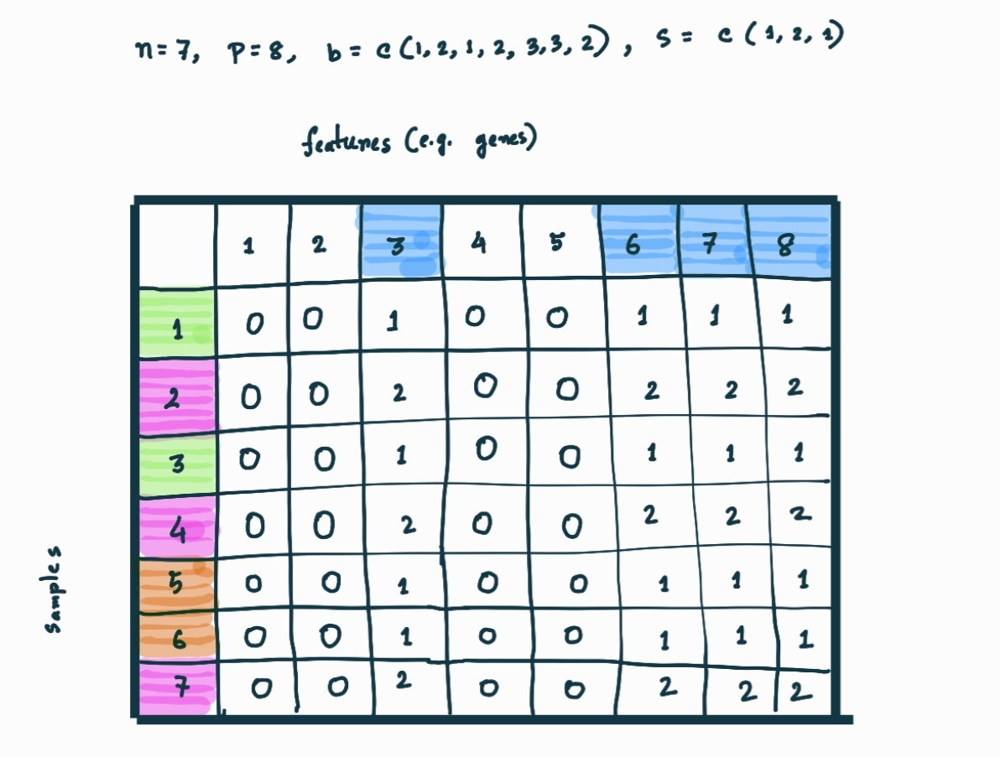

# simulatr 

<!-- badges: start -->
[](https://github.com/toscm/simulatr/actions)
[](https://app.codecov.io/gh/toscm/simulatr?branch=main)
[](https://cran.r-project.org/package=simulatr)
<!-- badges: end -->

An R package for simulating omics datasets either from scratch or from existing, publicly available datasets. Configurable parameters are correlation structure, biases, noise and the relationship between predictors and outcome variable.

## Table of Contents

- [simulatr ](#simulatr-)
  - [Table of Contents](#table-of-contents)
  - [Purpose](#purpose)
  - [Next Steps](#next-steps)
  - [Installation](#installation)
  - [Usage](#usage)
    - [The simplest one](#the-simplest-one)
  - [Contributing](#contributing)
  - [Related Work](#related-work)
    - [Summary](#summary)
    - [Links](#links)

## Purpose

Evaluation of statistical methods is best done with datasets where all relevant parameters can be controlled. Parameters of interest are e.g. the number of observations/features, the correlation structure between samples/features, the relationship between features and outcome and the amount of noise and/or biases within the data. As this is rarely possible with real-world datasets, it often makes sense to not only evaluate methods on real-world datasets, but also on simulated datasets. The goal of this package is therefore, to make simulation of such datasets as easy as possible.

## Next Steps

- [x] Either copy the package to your own private Github Account and make the repo public as soon as you want to upload the package to CRAN or make it public right now (recommended).
- [x] Do a literature research of existing packages for data simulation and their features. Write down the results in this README under section [Related Work](#related-work).
- [x] Implement the function `list_datasets` for listing potential base datasets for the simulation.
- [x] Implement the function `get_dataset` to do the actual simulation.
  - [ ] Use case 1: user specifies a base dataset measured with only one single platform and no platform: take all samples
  - [ ] Use case 2: user specifies a base dataset measured with multiple platforms and no platform: throw an error using `stop(<some useful message>)`
  - [ ] Use case 3: user specifies a base dataset measured with multiple platforms and a platform: use the samples measured with the specified platform
  - [ ] Use case 4: user specifies only a platform: download all samples for that platform (will require one more helper function `get_samples()` or similar.
  - [ ] Use case 5: no base dataset and no platform specfied
  - [ ] Implement `noise_func` / `noise_func_args` arguments: start with noise drawn from a normal distribution or a uniform distribution
  - [ ] Implement `bias_func` / `bias_func_args` arguments: first function name should be `constant_batch_effect` and it should take the number `n` of batches, the number `p` of affected features and the the value `s` given the batch-effect-strength.
  - [ ] Implement `cor` / `cortype` argument: be creative
- [ ] Implement the function `list_dataset` taking the output of `get_dataset` as argument.
- [x] Get the coverage check to pass.
- [ ] Make sure all functions are thoroughly documented. See <https://r-pkgs.org/man.html> for details on how to write documentation for R functions.
- [ ] Write tests for all functions. See <https://r-pkgs.org/tests.html> for details on how to write testcases for R functions.
- [ ] Document package usage either in a [vignette](https://r-pkgs.org/vignettes.html) or in chapter [Usage](#usage).
- [ ] Improve literature research results.
- [ ] Make `list_datasets` return all available Metadata (not just title title, type, platform_id and data_row_count)
- [ ] Publish the package to CRAN.
- [ ] Optional: speed up `list_datasets` by retrieving the metadata without actually downloading the expression matrix (maybe by querying the NCBI website)

## Installation

```R
# From Github (development version)
devtools::install_github("toscm/simulatr")
# From CRAN (stable version)
install.packages("simulatr") # not yet available
```

## Usage

### Simulate a dataset

#### The simplest one

Generates a (5,5) dataframe with random data.

```R
simulatr::simulate_dataset()

#result:

#           X1         X2         X3         X4         X5
# 1  0.07954922  1.0797440  0.6428168  0.6676199  0.7272287
# 2  0.15126274 -0.2704434 -0.1258170 -1.2300756 -0.2543250
# 3 -0.34563341 -0.2696411  0.7153013  0.9804060  1.3672825
# 4  0.03857418 -0.3278670  0.7207698 -1.3004286 -0.4472933
# 5 -0.29393465  0.1100270 -1.5629572 -1.7656558  0.9456364

```

#### With given dimension

The users can define the dimension of the simulated data. n is the number of
samples and p is the number of features (e.g. genes).

```R
simulatr::simulate_dataset(n = 2, p = 3)

# result :

#           X1         X2         X3
# 1  2.5037109  0.7780662 -0.8493910
# 2 -0.4439368 -0.5588823  0.4590951

```

#### With given data

The users can provide a dataframe from which they want to derive the simulated data.

```R
simulatr::simulate_dataset(n = 5, p = 5, base = data.frame(matrix(rnorm(6 * 6), 6, 6)))

# result :

#           X4         X5         X1          X2         X6
# 5  0.1256898 -0.3160537 0.04232887  1.18364610 0.02548396
# 3 -0.6574073  0.2382905 1.80930896 -0.80482068 1.40157078
# 1  1.9728739 -0.5976392 0.14674887 -1.29226331 0.48473688
# 6 -2.1417302  0.5517731 1.76103325 -0.22870073 0.66565249
# 4  0.2322724 -2.5704606 0.96798778  0.03665393 2.24897548

```

#### With given gse

The user can define the *gse* number. In that case, user will get simulated data related to that specific *gse* number.

```R
simulatr::simulate_dataset(n = 5, p = 5, gse = "GSE3821")

# result :

#             GSM87671 GSM87665 GSM87669 GSM87674 GSM87667
# 10484_at     51.5     93.5     13.8     90.3    125.1
# 2753_at     205.3    565.3     31.8      7.4    166.9
# 3632_at      32.6     52.5     19.1     44.3    129.5
# 9506_at     922.2    289.4    118.0    236.0      0.6
# 7886_at       1.0      8.0     24.7     33.3      1.7

```

#### With given noise

The users can choose the type of noise they want to add to their simulated data.
The users can either provide their own noise (a n*p dimensional matrix) or
choose from the given noise functions. If they choose the given noise function
they have to provide arguments for the chosen one. We provide noise function
with gaussian, poisson, exponential, binomial and uniform distribution.

##### Gaussian/normal noise function

Here argument sd is the standard deviation of the noise.

```R
simulatr::simulate_dataset(n = 5, p = 5, noise_func = random_noise, noise_func_args = list(sd = 1))

# result :

#            X1          X2         X3        X4         X5
# 1 -0.69791555  0.65353128  0.1576375 0.8861998 0.08378272
# 2  0.07894113  4.62759419 -0.5398236 2.5323452 1.95286403
# 3  0.36148932 -0.03017104  2.6283972 2.4019776 1.61741591
# 4  1.52561571  1.38624166  1.4993830 0.3052081 1.10903123
# 5  1.93360652 -2.11722575  3.3801689 0.2635528 3.13714589

```

##### Poisson noise

Here *lambda* is the argument of poisson noise.

```R
simulatr::simulate_dataset(n = 5, p = 5, noise_func = poisson_noise, noise_func_args = list(lambda = 1))

# result :

#           X1        X2         X3         X4         X5
# 1  2.5808568 0.4168481  1.7403153 -0.3837684  1.3131605
# 2  0.7283494 2.2950450  0.6518982  2.4346692 -3.1814076
# 3  0.9899551 1.0138370 -0.3008775  1.2168060  0.8645686
# 4 -0.1871961 1.8423962  0.1944272  0.8158043  2.1499120
# 5 -1.0280963 2.6924890  0.3397274  0.9826114 -0.2875561

```

##### Uniform noise

Here *min* and *max* are the function arguments of uniform noise. *min* and *max* define
the range of the noise.

```R
simulatr::simulate_dataset(n = 5, p = 5, noise_func = uniform_noise, noise_func_args = list(min = 1, max = 2))

# result :

#         X1         X2         X3       X4         X5
# 1 1.928619  2.4364068 -0.5226305 1.588079 -0.4676674
# 2 3.577087  2.4022115  0.4317342 1.522071  1.6404145
# 3 2.677303  0.6640803  1.4868414 2.392668  1.6421116
# 4 0.843235  0.3078904  3.4493710 1.172779  1.5029608
# 5 1.722469 -0.1935247  2.0272924 1.934207  1.8488969

```

##### Binomial noise

Here *size* and *prob* are the function arguments. *size* defines the number of trials
and *prob* defines the probability of success on each trial.

```R
simulatr::simulate_dataset(n = 5, p = 5, noise_func = binomial_noise, noise_func_args = list(size=10, prob=0.5))

# result :

#         X1       X2       X3       X4       X5
# 1 6.369510 3.070095 5.110972 2.846576 7.401457
# 2 7.508578 4.070030 6.120108 7.377817 4.725431
# 3 1.207935 4.728687 3.429556 3.599847 4.440382
# 4 5.121097 5.172166 5.484836 5.188745 6.384407
# 5 5.342285 6.711157 5.616503 3.893173 3.452521

```

##### Exponential noise

Here *rate* is the function argument.

```R
simulatr::simulate_dataset(n = 5, p = 5, noise_func = exponential_noise, noise_func_args = list(rate = 1))

result :

          X1          X2         X3        X4          X5
1 -0.2035384  0.01890351  3.8764838 1.3464868 -0.01945084
2 -1.1027431  1.23864130 -1.4897532 0.5608686  0.55288751
3  0.5977199  1.26828733 -0.4237199 0.1515011  2.28350774
4 -0.1596974  2.01130450  1.4105792 3.1737743  0.99300449
5  0.1805583 -0.46096453  0.9261371 0.3952754  0.85035973

```

#### With given bias

The users can choose the type of bias they want to add to their simulated data.
The users can either provide their own bias (a (n,p) dimensional matrix) or
choose from the given bias functions. If they choose the given bias function,
they have to provide arguments for the chosen one. We provide bias function
named*constant_batch_effect*.

##### Constant batch effect

*n* and *p* denotes the number pf samples and features respectively. *b* denotes the batch each sample belongs to. Suppose the samples come from 3 different places. User can define which sample belongs to which place. If *b = c(1,2,1,2,3,3,2)*, that means sample1 belongs to batch1, sample2 belongs to batch2, sample3 belongs to batch1, sample5 belongs to batch3 and so on. *f* denotes the number of features to be affected. If user chooses f=4, then 4 features will be randomly selected. *s* denotes how much each batch is affected. *s = c(1,2,1)* means batch1, batch2 and batch3 will be affected by 1, 2 and 1 respectively.

Here is an example :


<br>
<br>

```R
simulatr::simulate_dataset( n = 7,
                            p = 8,
                            base = data.frame(matrix(0, 7, 8)),
                            bias_func = constant_batch_effect,
                            bias_func_args = (list(b=c(1,2,1,2,3,3,2),
                            f=4,
                            s=c(1,2,1))))

# result :

#     X1 X2 X3 X4 X5 X6 X7 X8
#  1  1  0  1  1  0  1  0  0
#  2  2  0  2  2  0  2  0  0
#  3  1  0  1  1  0  1  0  0
#  4  2  0  2  2  0  2  0  0
#  5  1  0  1  1  0  1  0  0
#  6  1  0  1  1  0  1  0  0
#  7  2  0  2  2  0  2  0  0  

````

User can call a simplified version of constant_batch_effect. if users define b = 2, then samples will be randomly assigned to 2 different batches.

```R
simulatr::simulate_dataset( n = 5,
                            p = 5,
                            base = data.frame(matrix(0, 5, 5)),
                            bias_func = constant_batch_effect,
                            bias_func_args = (list(b=2,
                            f=4,
                            s=c(1,2))))

# result :

#   X1 X2 X3 X4 X5
# 1  2  0  2  2  2
# 2  1  0  1  1  1
# 3  2  0  2  2  2
# 4  2  0  2  2  2
# 5  1  0  1  1  1

```

Here sample2 and sample5 belongs to batch1 and other samples belong to batch2. batch1 if affected by 1 wheras batch2 is affected by 2.feature1, feature3, feature4 and feature5 is affected.

In a more simplified version, all the batches will be affected by the same amount.

```R
simulatr::simulate_dataset( n = 5,
                            p = 5,
                            base = data.frame(matrix(0, 5, 5)),
                            bias_func = constant_batch_effect,
                            bias_func_args = (list(b=2,
                            f=2,
                            s=1)))

# result :

#  X1 X2 X3 X4 X5
# 1  0  0  0  1  1
# 2  0  0  0  1  1
# 3  0  0  0  1  1
# 4  0  0  0  1  1
# 5  0  0  0  1  1

```

Here feature4 and feature5 are affected. All the batches are affected by the same number.

#### Some more examples

### List of the platforms

Provides list of all the platforms(e.g. GPL97) available in NCBI.

```R
utils::head(simulatr::list_platforms(),3)

# A part of the result that can be retrieved by this function :

# Accession                                                                     Title                 Technology
# 1  GPL25897                             Illumina HiSeq 4000 (Fagopyrum hailuogouense) high-throughput sequencing
# 2  GPL25881 Qiagen Mouse Inflammatory Response and Autoimmunity PCR Array (PAMM-077Z)                     RT-PCR
# 3  GPL25892                                               HiSeq X Ten (Rattus rattus) high-throughput sequencing
#                  Taxonomy Data.Rows Samples.Count Series.Count           Contact Release.Date
# 1 Fagopyrum hailuogouense         0             6            1               GEO Dec 05, 2018
# 2            Mus musculus        96            34            1 Patricia Silveyra Dec 04, 2018
# 3           Rattus rattus         0             8            1               GEO Dec 04, 2018

```

### Retrieve data for a given platform

User can retrieve data for a specific platform (e.g. GPL97)

```R
simulatr::get_gpl_data("GPL96")

# result :
#
# GEO Accession Title                                            Technology                Organism       Status
# a "GPL96"       "[HG-U133A] Affymetrix Human Genome U133A Array" "in situ oligonucleotide" "Homo sapiens" "Public on Mar 11 2002"  

```

### List of the datasets

Information about all gse (e.g. GSE465) related to a specific platform (e.g. GPL95)

```R
simulatr::list_datasets(platform = "GPL95")

# result :

#        Accession                                                                                      Title
# 20365     GSE465                                           Expression profiling in the muscular dystrophies
# 151738    GSE762                                                                            CCFAlmasan_CaP1
# 32434     GSE803                                                     GeneNote-Gene Normal tissue Expression
# 74830    GSE1007 Molecular profiles(HG-U95B,C,D,E) of dystrophin-deficient and normal human skeletal muscle
# 147372   GSE1302                                                                  primary trophoblast study
# 20322    GSE2508                                         Expression profiling in adipocytes of obese humans
# 164705   GSE5949       Comparison between cell lines from 9 different cancer tissue (NCI-60) (U95 platform)
# 16539   GSE51625                          Expression data from human abdominal, subcutaneous adipose tissue
#                          Series.Type     Taxonomy Sample.Count                                        Datasets Supplementary.Types
# 20365  Expression profiling by array Homo sapiens           57              GDS214;GDS262;GDS264;GDS265;GDS270                 CEL
# 151738 Expression profiling by array Homo sapiens           25              GDS719;GDS720;GDS721;GDS722;GDS723
# 32434  Expression profiling by array Homo sapiens          120              GDS422;GDS423;GDS424;GDS425;GDS426
# 74830  Expression profiling by array Homo sapiens           86                     GDS609;GDS610;GDS611;GDS612         CEL;EXP;RPT
# 147372 Expression profiling by array Homo sapiens           75
# 20322  Expression profiling by array Homo sapiens          195 GDS1495;GDS1496;GDS1497;GDS1498;GDS3601;GDS3602
# 164705 Expression profiling by array Homo sapiens          300                                                             CEL;EXP
# 16539  Expression profiling by array Homo sapiens          120                                                                 CEL
#                                                  Supplementary.Links                  PubMed.ID SRA.Accession              Contact
# 20365      ftp://ftp.ncbi.nlm.nih.gov/geo/series/GSEnnn/GSE465/suppl                   11121445                     Eric P Hoffman
# 151738                                                                                                        John Gilmary Hissong
# 32434                                                                                  15388519                       Orit Shmueli
# 74830    ftp://ftp.ncbi.nlm.nih.gov/geo/series/GSE1nnn/GSE1007/suppl                   12698323                     Judith Haslett
# 147372                                                                                 15161964                        Brig Mecham
# 20322                                                                         16059715;18424589                        Yong-Ho Lee
# 164705   ftp://ftp.ncbi.nlm.nih.gov/geo/series/GSE5nnn/GSE5949/suppl 20053763;26048278;25003721                  Uma T Shankavaram
# 16539  ftp://ftp.ncbi.nlm.nih.gov/geo/series/GSE51nnn/GSE51625/suppl                   24103848                    Carol Shoulders
#        Release.Date
# 20365  Jul 16, 2003
# 151738 Jun 01, 2004
# 32434  Nov 19, 2003
# 74830  Feb 04, 2004
# 147372 Apr 13, 2004
# 20322  Jan 01, 2006
# 164705 Aug 06, 2007
# 16539  Oct 29, 2013

```
 
## Contributing

1. Create a new feature branch
2. Commit your changes
3. Push your changes
4. Create a pull request
5. Wait until all tests have completed
6. Merge the pull request

To publish a version to CRAN, run the following commands in an active R session:

```R
devtools::document() # Update documentation
rcmdcheck::rcmdcheck( # Run `R CMD check` for this package
    args=c("--no-manual", "--as-cran"),
    build_args=c("--no-manual"),
    check_dir="check"
)
devtools::revdep() # Run `R CMD check` for all dependencies
devtools::spell_check() # Check spelling of package
devtools::release() # Builds, tests and submits the package to CRAN.
# Manual submission can be done at: https://cran.r-project.org/submit.html
```

Source: <https://r-pkgs.org/release.html>

## Related Work

### Summary

|                                                               | MOSim | MadSim | Simulatr |      |
| :------------------------------------------------------------ | :---- | :----- | :------- | :--- |
| number of features can be specified                           | x     | x      | x        |      |
| percentage of differentially expressed genes can be specified | x     | x      | x        |      |
| correlation structure can be specified                        |       | x      | x        |      |
| type of data (RNAseq/DNAseq)  can be specified                | x     |        | x        |      |
| platform (HGU133a, ...)  can be specified                     |       |        | x        |      |
| standard deviation or noise can be specified                  |       | x      | x        |      |
| ability to work with base dataset                             | x     | x      | x        |      |
| upper and lower limit can be specified                        |       | x      | x        |      |
| easy to read instruction                                      |       |        | x        |      |

- x means yes

### Links

- Omics Simla <https://omicssimla.sourceforge.io/>
- micro array data simulation <https://www.ncbi.nlm.nih.gov/pmc/articles/PMC5003477/>
