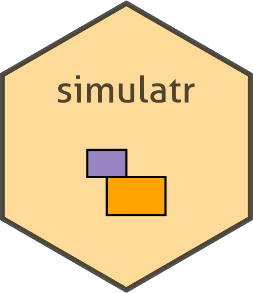

# simulatr 

<!-- badges: start -->
[](https://github.com/toscm/simulatr/actions)
[](https://app.codecov.io/gh/toscm/simulatr?branch=main)
[](https://cran.r-project.org/package=simulatr)
<!-- badges: end -->

An R package for simulating omics datasets either from scratch or from existing, publicly available datasets. Configurable parameters are correlation structure, biases, noise and the relationship between predictors and outcome variable.

## Table of Contents

- [simulatr ](#simulatr-)
  - [Table of Contents](#table-of-contents)
  - [Purpose](#purpose)
  - [Next Steps](#next-steps)
  - [Installation](#installation)
  - [Usage](#usage)
  - [Contributing](#contributing)
  - [Related Work](#related-work)
    - [Summary](#summary)
    - [Links](#links)

## Purpose

Evaluation of statistical methods is best done with datasets where all relevant parameters can be controlled. Parameters of interest are e.g. the number of observations/features, the correlation structure between samples/features, the relationship between features and outcome and the amount of noise and/or biases within the data. As this is rarely possible with real-world datasets, it often makes sense to not only evaluate methods on real-world datasets, but also on simulated datasets. The goal of this package is therefore, to make simulation of such datasets as easy as possible.

## Next Steps

* Either copy the package to your own private Github Account and make the repo public as soon as you want to upload the package to CRAN or make it public right now (recommended).
* Do a literature research of existing packages for data simulation and their features. Write down the results in this README under section [Related Work](#related-work).
* Implement the function `list_datasets` for listing potential base datasets for the simulation.
* Implement the function `simulate_dataset` to do the actual simulation.
* Get the coverage check to pass.
* Make sure both functions and all used helper functions are thoroughly documented. See <https://r-pkgs.org/man.html> for details on how to write documentation for R functions.
* Write tests for both functions and all used helper functions. See <https://r-pkgs.org/tests.html> for details on how to write testcases for R functions.
* Document package usage either in a [vignette](https://r-pkgs.org/vignettes.html) or in chapter [Usage](#usage).
* Publish the package to CRAN.

## Installation

```R
# From Github (development version)
devtools::install_github("toscm/simulatr")
# From CRAN (stable version)
install.packages("simulatr") # not yet available
```

## Usage

```R
dataset <- simulatr::simulate_dataset()
# to be done
```

## Contributing

For every feature you are planning to implement:

1. Create a new feature branch
2. Commit your changes
3. Push your changes
4. Create a pull request
5. Wait until all tests have completed
6. Merge the pull request

To publish a version to CRAN, run the following commands in an active R session:

```R
devtools::document() # Update documentation
rcmdcheck::rcmdcheck( # Run `R CMD check` for this package
    args=c("--no-manual", "--as-cran"),
    build_args=c("--no-manual"),
    check_dir="check"
)
devtools::revdep() # Run `R CMD check` for all dependencies
devtools::spell_check() # Check spelling of package
devtools::release() # Builds, tests and submits the package to CRAN.
# Manual submission can be done at: https://cran.r-project.org/submit.html
```

Source: <https://r-pkgs.org/release.html>

## Related Work

### Summary

|                                                               | MOSim | MadSim | Simulatr |      |
| :------------------------------------------------------------ | :---- | :----- | :------- | :--- |
| number of genes can be specified                              |       | x      | x        |      |
| number of features can be specified                           | x     | x      | x        |      |
| percentage of differentially expressed genes can be specified | x     | x      | x        |      |
| correlation structure can be specified                        |       | x      | x        |      |
| type of data (RNAseq/DNAseq)  can be specified                | x     |        | x        |      |
| platform (HGU133a, ...)  can be specified                     |       |        | x        |      |
| standard deviation or noise can be specified                  |       | x      | x        |      |
| ability to work with base dataset                             | x     | x      | x        |      |
| upper and lower limit can be specified                        |       | x      | x        |      |
| easy to read instruction                                      |       |        | x        |      |


* x means yes

### Links

* Omics Simla <https://omicssimla.sourceforge.io/>
* micro array data simulation <https://www.ncbi.nlm.nih.gov/pmc/articles/PMC5003477/>


